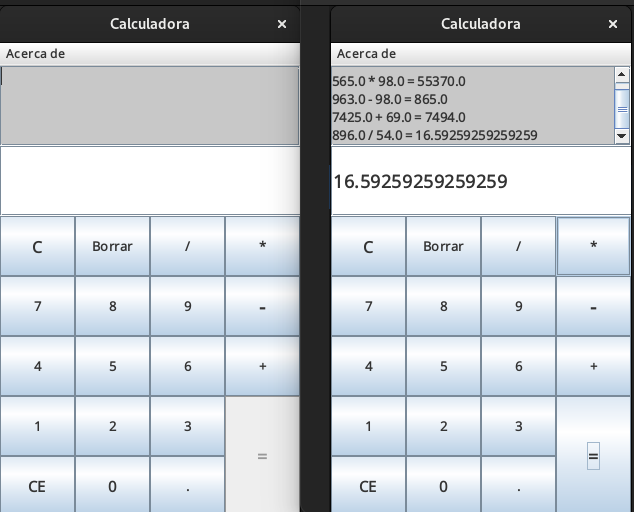

# Calculadora

Calculadora desarrollada en Java con una interfaz gráfica
realizada en Java Swing. Incluye funciones como el cálculo de
operaciones básicas y un menú con la información del
desarrollador. El objetivo del proyecto era clonar la
calculadora presente en los sistemas operativos Linux.
    
## Objetivos del proyecto:
1. Poner en practica los conocimientos adquiridos en los cursos sobre
programación basica con Java:
    - Java Swing
 
2. Mejorar mi lógica de programación.

## ¿Como usar el programa?
1. Descarga los archivos en tu equipo.

#### Para ejecutarlo utilizando un IDE:
Abre la carpeta desde tu IDE preferido y corre el programa directamente
desde la clase Main.

### Para ejecutarlo sin utilizar un IDE:
1. Descarga el archivo Calculadora.jar
2. Ejecuta el .jar de acuerdo a tu SO.
 
Ya puedes hacer uso del programa :).
 
Nota: Recuerda tener instalado JDK 21.0.4 en tu equipo.
